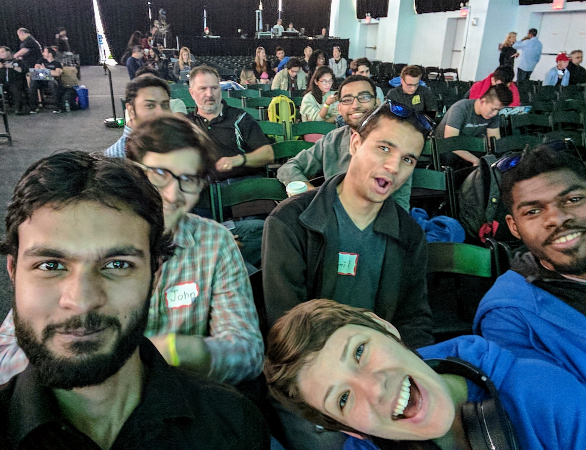

# Helperbee

## Moving to the US is hard! For people who are new to country going to the DMV, the passport office, the doctors office, or even figuring out the laundromat can be challenging!

### Helperbee is an online service to help people navigate these tasks in a new community, with local volunteers who are willing to help out. 

There are many ordinary Americans who support immigrants in their communities, but don't know how best to show it. They might have gone to the Women's March or come out to peacefully protest the travel ban, but want to do more. 

Helperbee is designed to connect people who want to help their neighbors adjust to the community. Helperbee provides an opportunity for people who share languages and cultures to connect in meaningful ways. Helperbee allows people who seek to learn more about different cultures to learn, while experiencing some of the challenges of immigration alongside their neighbors.

Look, we're on the Nexmo twitter, the best dressed team at the hackathon! 

https://twitter.com/Nexmo/status/863587297354272768

### Hackathon Process

The Team! We got jumpers at about midnight and took a quick break to snap this shot on the TechCrunch stage, then back to programming!

This table was our home for 24 hours, some team-mates also napped under this table :)

Sitting in the audience watching the presentations, so many amazing projects. We are all happy to be in the room with such a smart/talented group of hackers! :D